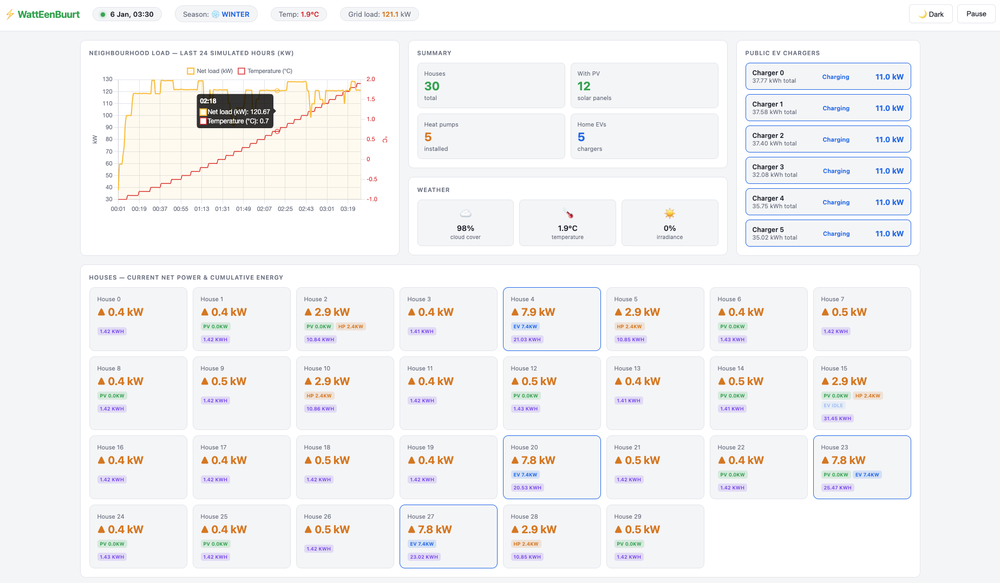
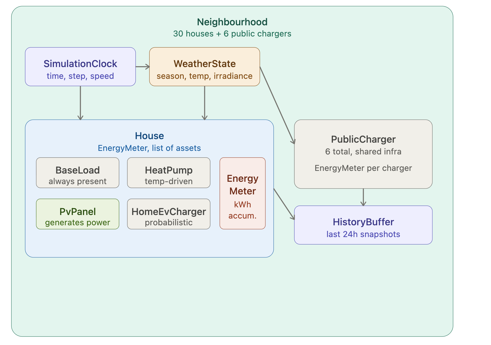

# WattEenBuurt

Real-time energy neighbourhood simulator. Models 30 houses with solar panels, heat pumps, and EV chargers, plus public charging stations. Visualises live power flows on an interactive web dashboard.

# TL;DR

A public image has been pushed:

```
docker pull nbodev/watteenbuurt:latest
docker run -p 8080:8080 nbodev/watteenbuurt:latest`
```

The result:



## Requirements

| Tool | Minimum version |
|---|---|
| Java JDK | 21 |
| Maven | 3.9+ (or use the included `./mvnw` wrapper — no install needed) |
| Docker | 24+ (only for containerised runs) |

## Compile

```bash
./mvnw clean package
```

The executable JAR is produced at `target/watteenbuurt-0.0.1-SNAPSHOT.jar`.

To skip tests (none exist yet):

```bash
./mvnw clean package -DskipTests
```

## Run

**Option A — Maven dev mode (recommended for development)**

```bash
./mvnw spring-boot:run
```

**Option B — run the JAR directly**

```bash
java -jar target/watteenbuurt-0.0.1-SNAPSHOT.jar
```

The application starts on port **8080** by default.

### Override configuration at runtime

Any `application.yaml` property can be overridden via command-line arguments:

```bash
./mvnw spring-boot:run \
  --spring-boot.run.arguments="--simulation.house-count=50 --simulation.tick-interval-ms=100"
```

Or with the JAR:

```bash
java -jar target/watteenbuurt-0.0.1-SNAPSHOT.jar \
  --simulation.house-count=50 \
  --simulation.clock-start-time=2025-06-01T08:00:00
```

## Access the application

| URL | Description |
|---|---|
| http://localhost:8080 | Live dashboard |
| http://localhost:8080/swagger-ui.html | Interactive API explorer |
| http://localhost:8080/v3/api-docs | Raw OpenAPI JSON spec |
| http://localhost:8080/actuator/health | Health check |

### Using the Swagger UI

1. Open http://localhost:8080/swagger-ui.html in your browser.
2. Expand a section (**Simulation** or **Neighbourhood**) to see available endpoints.
3. Click an endpoint → **Try it out** → **Execute** to call it directly from the browser.
4. Use `POST /api/simulation/control` with body `{"action": "pause"}` or `{"action": "resume"}` to control the simulation clock.

## Domain model



```
Neighbourhood (30 houses + 6 public chargers)
│
├── SimulationClock ──► WeatherState (season, temp, irradiance)
│         │                    │
│         └────────────────────┤
│                              ▼
├── House (×30)                        PublicCharger (×6)
│   ├── Asset: BASE_LOAD               ├── Asset: PUBLIC_EV_CHARGER
│   │         always present           └── EnergyMeter
│   ├── Asset: PV_PANEL                          │
│   │         generates power                    │
│   ├── Asset: HEAT_PUMP                         ▼
│   │         temp-driven               HistoryBuffer
│   ├── Asset: HOME_EV_CHARGER          last 24h snapshots
│   │         probabilistic
│   └── EnergyMeter (net kWh accum.)
```

| Component | Responsibility |
|---|---|
| `SimulationEngine` | Main loop — advances clock, ticks every asset, stores snapshots |
| `SimulationClock` | Tracks simulated time, start/stop control |
| `WeatherService` | Deterministic weather derived from simulated date (no external API) |
| `NeighbourhoodFactory` | Builds 30 houses + 6 chargers from config + seeded RNG |
| `HistoryBuffer` | Thread-safe ring buffer of last 1440 snapshots (24h × 60 min) |
| `EnergyMeter` | Per-asset kWh accumulator (monotonic) |
| Asset calculators | One class per asset type — pure functions, no side effects |

### Simulation clock

- **Step size:** 1 simulated minute per tick
- **Tick rate:** configurable via `tick-interval-ms` (default 200 ms = 5 sim-min/sec ≈ 4.8 simulated hours per real minute)
- **Start time:** configurable via `clock-start-time` in `application.yaml`

## Assumptions

### PV panels
- Peak output: 4 kWp (typical 12-panel residential installation)
- Generation offsets house load first; surplus exports to the grid as **negative net load**
- No battery storage modelled

### Heat pumps
- Space heating only (no cooling)
- Power scales linearly with degrees below 18 °C comfort threshold — fully off at 18 °C+, ~3.5 kW at −5 °C

### EV chargers — home
- Power: 7.4 kW (Mode 2 AC)
- Session start probability: 8% per tick when idle
- Session duration: 30–120 simulated minutes (uniform random)

### EV chargers — public
- Power: 11 kW (Type 2 AC)
- Session start probability: 15% per tick when idle
- Session duration: 30–120 simulated minutes (uniform random)
- Usage is independent of any specific house — models passing traffic and neighbourhood residents

### Weather
- Fully deterministic, derived from simulated date and fixed seed
- Temperature: seasonal sine curve (~2 °C winter, ~22 °C summer) + daily ±4 °C swing
- Cloudiness: seeded random per simulated day, biased toward more clouds in winter
- Irradiance: sine arc between sunrise and sunset, zero at night, scaled by season

### Base load
- Shape: two Gaussian peaks (morning ~7:30, evening ~19:00)
- Range: ~0.4 kW night baseline to ~3.5 kW evening peak
- Per-house noise: ±10% per tick to simulate appliance switching

### Asset distribution
- Assigned by seeded RNG at startup — combinations are allowed (a house can have PV + heat pump + EV)
- Expected counts at seed 42: ~12 PV panels, ~9 heat pumps, ~6 home EV chargers

## Known limitations

- No battery storage model
- EV charging is purely probabilistic — no commute schedule or occupancy model
- Heat pump does not model thermal mass or building insulation
- No grid export tariff or cost calculations
- Weather is per-day random, not continuous — cloudiness can jump between days
- Public charger usage is not time-of-day weighted (equally likely at 3 am and 3 pm)
- History does not survive application restarts

## Dockerise

A public image is available on Docker Hub — no build step required:

```bash
docker pull nbodev/watteenbuurt:latest
docker run -p 8080:8080 nbodev/watteenbuurt:latest
```

### Build the image locally

Build the JAR first, then build the image:

```bash
./mvnw clean package -DskipTests
docker build -t nbodev/watteenbuurt:latest .
```

**`Dockerfile`** (create at project root if not present):

```dockerfile
FROM eclipse-temurin:21-jre
WORKDIR /app
COPY target/watteenbuurt-0.0.1-SNAPSHOT.jar app.jar
EXPOSE 8080
ENTRYPOINT ["java", "-jar", "app.jar"]
```

### Run the container

```bash
docker run -p 8080:8080 nbodev/watteenbuurt:latest
```

Override configuration via environment variables (Spring Boot maps `SIMULATION_HOUSE_COUNT` → `simulation.house-count`):

```bash
docker run -p 8080:8080 \
  -e SIMULATION_HOUSE_COUNT=50 \
  -e SIMULATION_TICK_INTERVAL_MS=300 \
  -e SIMULATION_CLOCK_START_TIME=2025-06-01T08:00:00 \
  nbodev/watteenbuurt:latest
```